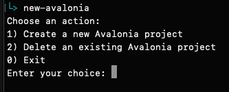

## Bash-scripts

avalonia.sh | Simple script to create a Avalonia MVVM project with a default location and start it with rider.


1. Create a folder for your Avalonia projects somewhere.

2. Edit the avalonia.sh to the new path.
```
# Avalonia projects default location
default_location="$HOME/Path/To/Avalonia"
```

3. Add alias for the terminal. 
- Example: nano .zshrc
```    
# Create Avalonia Apps
alias new-avalonia="/path/to/scripts/new-avalonia.sh"
```
4. Restart terminal.

5. Done.

